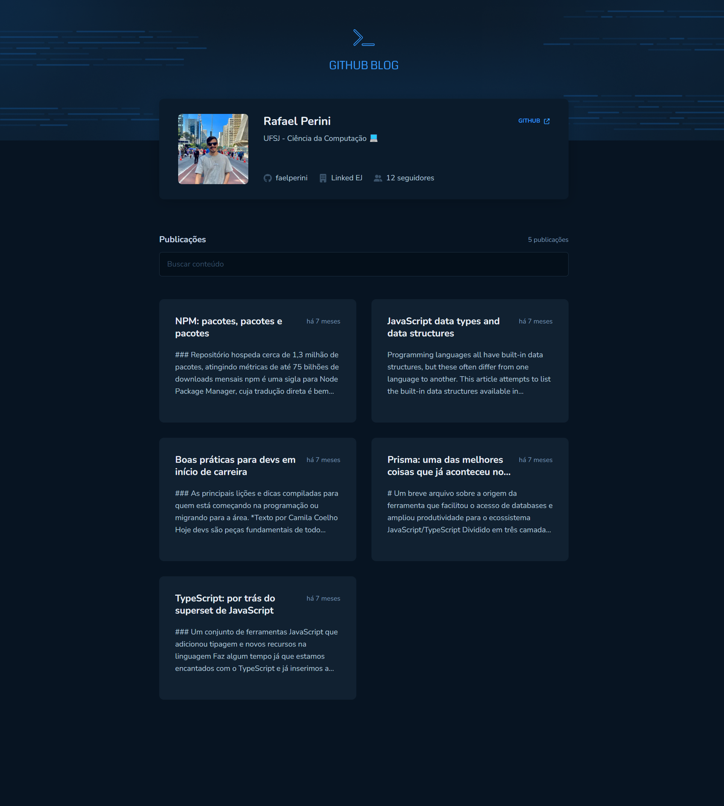
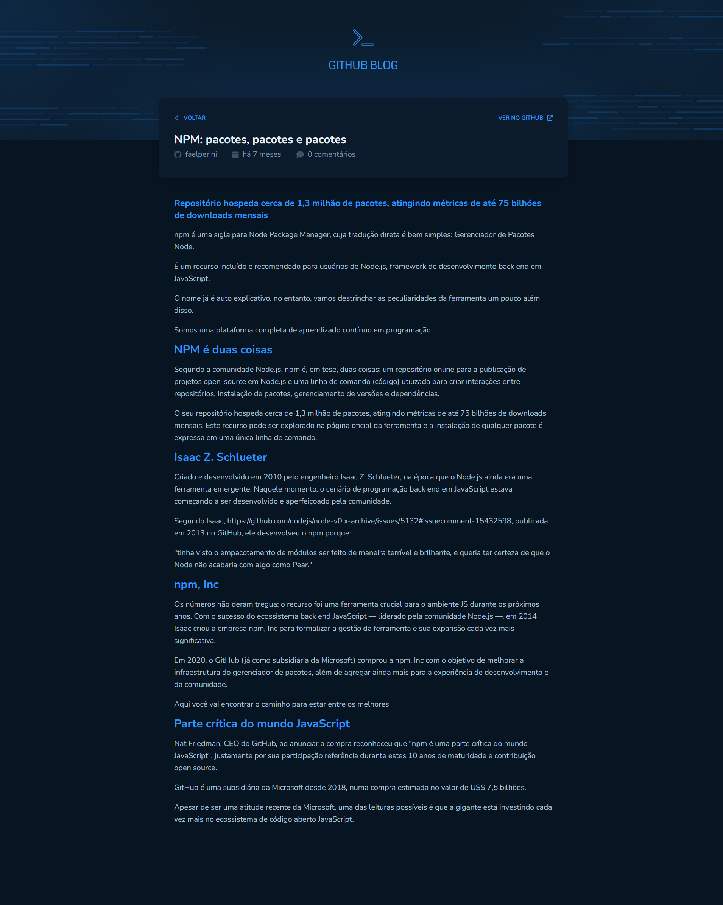
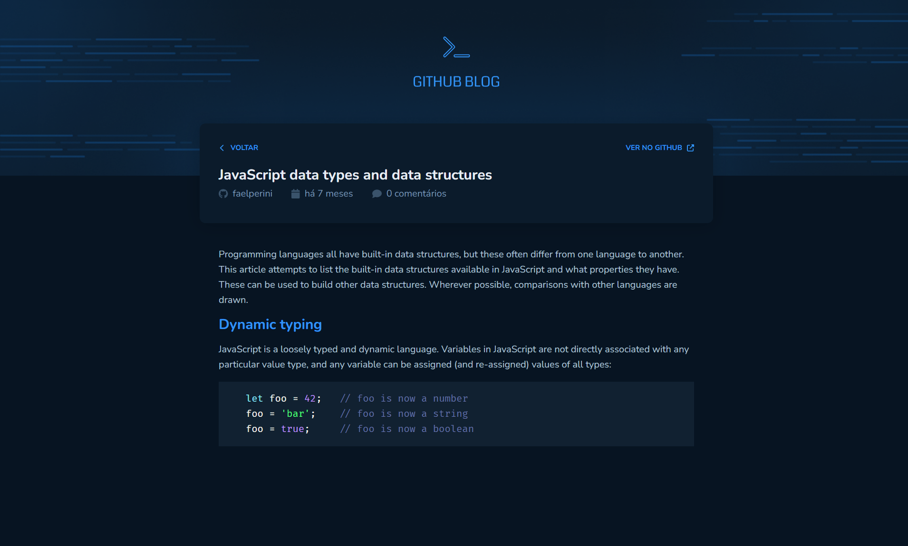

# GitHub Blog - Um Blog Pessoal com a API do GitHub

## Descrição

Este projeto tem como objetivo criar um blog pessoal utilizando a API do GitHub como fonte de dados. A aplicação busca informações do perfil do usuário, como imagem, número de seguidores e nome, e lista as issues de um repositório específico, exibindo-as como posts.







## Tecnologias

* **React:** Biblioteca JavaScript para construção de interfaces de usuário.
* **react-router-dom:** Biblioteca para gerenciamento de rotas e navegação entre páginas.   
* **axios:** Para realizar requisições HTTP à API do GitHub.
* **styled-components:** Biblioteca para criação de estilos CSS dentro do JavaScript.
* **react-hook-form:** Biblioteca para gerenciamento de formulários com hooks.
* **zod:** Biblioteca para validação de dados.
* **react-markdown:** Biblioteca para renderização de Markdown.
* **react-syntax-highlighter:** Biblioteca para destaque de sintaxe de código.
* **@hookform/resolvers:** Resolutor para o react-hook-form, utilizado para validar dados de formulários.


## Como executar o projeto

1. **Clone o repositório:**
  ```bash
  git clone https://github.com/faelperini/03-github-blog
  ```

2. **Instale as dependências:**
  ```bash
  cd 03-github-blog
  npm install
  ```

3. **Inicie o desenvolvimento:**
  ```bash
  npm run dev
  ```

O aplicativo será iniciado em http://localhost:5173/

## Funcionalidades

* **Perfil do Usuário:** Exibe informações básicas do perfil do usuário, como nome, imagem e número de seguidores, obtidas diretamente da API do GitHub.
* **Listagem de Issues:** Lista todas as issues de um repositório configurado, apresentando um resumo de cada uma, como título e descrição.
* **Filtragem de Issues:** Permite filtrar as issues por diversos critérios, como labels, autor ou data de criação.
* **Visualização Detalhada:** Ao clicar em uma issue, o usuário é direcionado para uma página que exibe o conteúdo completo da issue, incluindo comentários.
